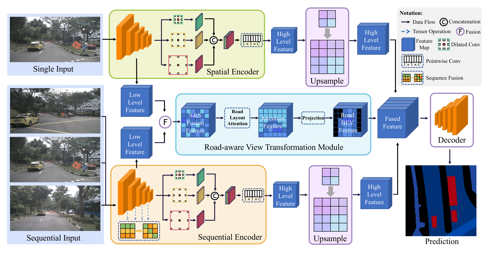
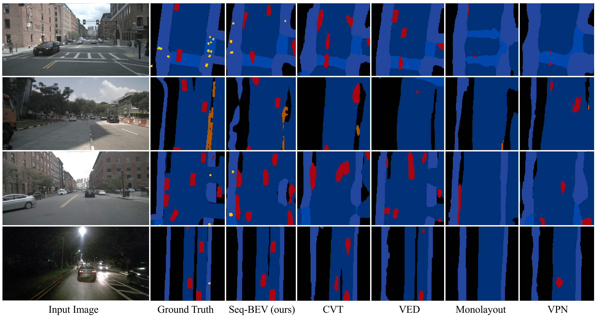

# Seq-BEV: Semantic Bird-Eye-View Map Generation in Full View using Sequential Images for Autonomous Driving

This is the offical PyTorch implementation of Seq-BEV: Semantic Bird-Eye-View Map Generation in Full View using Sequential Images for Autonomous Driving (IEEE TITS).

# Introduction
Semantic Bird-Eye-View (BEV) map is a straightforward data representation for environment perception. It can be used for downstream tasks, such as motion planning and trajectory prediction. However, taking as input a front-view image from a single camera, most existing methods can only provide V-shaped semantic BEV maps, which limits the field-of-view for the BEV maps. To provide a solution to this problem, we propose a novel end-to-end network to generate semantic BEV maps in full view by taking as input the equidistant sequential images. Specifically, we design a self-adapted sequence fusion module to fuse the features from different images in a distance sequence. In addition, a road-aware view transformation module is introduced to wrap the front-view feature map into BEV based on an attention mechanism. We also create a dataset with semantic labels in full BEV from the public nuScenes data. The experimental results demonstrate the effectiveness of our design and the superiority over the state-of-the-art methods.

# Contributions
- We propose a novel semantic BEV map generation network that takes as input a set of equidistant sequential images sampled at uniform distance intervals and outputs a semantic BEV map in full view.
- We design a new self-adapted sequence fusion module to fuse the features from different images, which provides complementary information to get more views.
- We provide a new method for view transformation by first extracting the attention of road planes and then projecting attention-based features to BEV.
- We create a dataset with semantic ground-truth labels in full view from the nuScenes dataset to train and test our method.

# Training and Testing

Pretrain weights and dataset:

https://nas.labsun.org/downloads/2025_tits_seqbev/

Train the Seq-BEV:

`python3 train.py --model_name selfAdapt `

Test the Seq-BEV:

`python3 seqBEV_test_selfAdapt.py`

# Results

# Video Demo
[Video Demo](https://www.youtube.com/watch?v=pWQTqKjdl7g)
